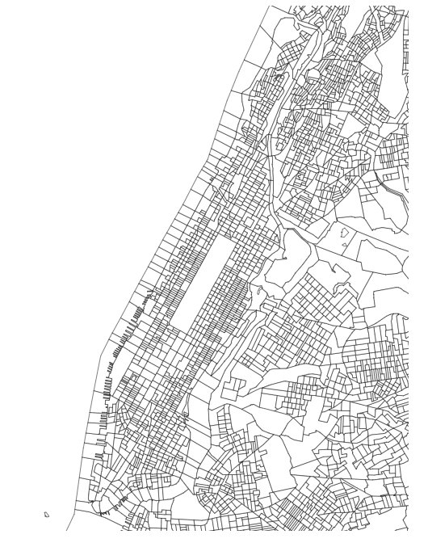
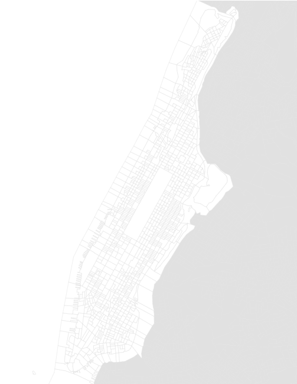
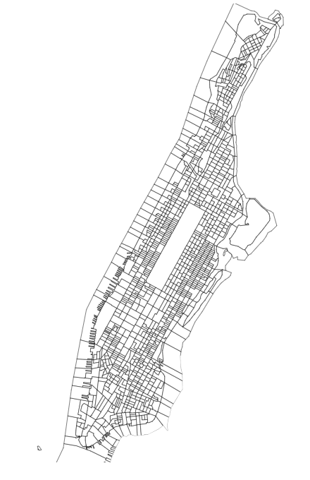
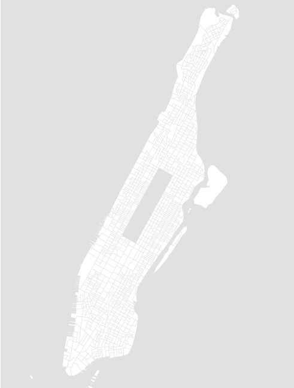

### Part 1 - Creating a Map in D3

For my third project at Metis, I attempted to predict whether or not a certain block in Manhattan or the Bronx would be found to have "active rat signs" when inspected by the NYC Health Department in a given quarter of the year. While I was fairly happy with the results from my model, I wanted to be able to visualize the results of the rat inspections using a D3-based map. I felt like it would be interesting to see how the rats are moving around the city and where the Department of Health is carrying out their inspections. All data was obtained from from the NYC Open Data [Rodent Inspection dataset](https://data.cityofnewyork.us/Health/Rodent-Inspection/p937-wjvj).

#### Getting the Data
Originally I had hoped I could find a good example of a map of New York to hack at, but couldn't find D3 map visualization of New York City by block. I knew I needed to be able to get a map at this level of detail to properly visualize the data. Step one was to find a file that had the shapes I needed to map out.

From my research, I found three types of files that are commonly published: [TopoJSON](https://en.wikipedia.org/wiki/GeoJSON#TopoJSON), [GeoJSON](https://en.wikipedia.org/wiki/GeoJSON), and [Shapefiles](https://en.wikipedia.org/wiki/Shapefile) (.shp). I am not a GIS or mapping expert, but my understanding is that  Shapefiles are popular for use in GIS software, while Topo- and GeoJSON files are more lightweight files. D3 seems to be able to handle both types of JSON files, so I searched for those.

NYC Open Data and the Planning Department publish Shapefiles for each of the boroughs via their [PLUTO portal](https://www1.nyc.gov/site/planning/data-maps/open-data/dwn-pluto-mappluto.page), but they only publish GeoJSON files for the Bronx - all the other boroughs have Shapefiles. Since I'm less familiar with the Bronx and because domain knowledge is always important, I thought building some intuition on Manhattan would be easier. If you're interested in converting Shapefiles to GeoJSON, I saw many recommendations for [MapShaper](http://mapshaper.org/). Give it a shot!

I ended up finding a good GeoJSON file from [Data.BetaNYC](http://data.beta.nyc/dataset/2010-census-block-groups-polygons/resource/d2cf6fe5-1914-474e-8648-085ca7067bde?view_id=08b80a8a-36f4-4d24-8804-e9781dcdde58). This format isn't exactly what I wanted since my prediction is by "tax block" and the GeoJSON is separated into census blocks. Because I had the corresponding census block in my dataset, I decided to go with it.

#### Creating the Map
There are a number of resources out there on how to use these files in D3 to create a map and [Mike Bostock](https://github.com/mbostock), the creator of D3, put out a few tutorials [here](https://bost.ocks.org/mike/map/) and [here](https://medium.com/@mbostock/command-line-cartography-part-1-897aa8f8ca2c). He recommends TopoJSON, but I could never quite get it to work. For this tutorial I'm going to stick with GeoJSON.

First things first - the HTML file must to be built and the required D3 javascript libaries need to be imported.

```javascript
<!DOCTYPE html>
<html lang="en">
<head>
    <meta charset="utf-8">
    <meta http-equiv="pragma" content="no-cache">
    <meta http-equiv="expires" content="-1">
    <script src="https://d3js.org/d3.v4.min.js"></script>
    <script src="https://d3js.org/d3-scale-chromatic.v1.min.js"></script>
    <script src="https://d3js.org/topojson.v2.min.js"></script>
</head>
```

The map will be drawn in the body. First, I needed to create the javascript tag and set the width and height of the D3 object. You may need to change this based on how much of New York you'd like to see.

Then I built the projection. In my case, I use the simple geoMercator projection. More information on the various projections can be found on the [D3-Geo repo](https://github.com/d3/d3-geo).  The translate, center, and scale properties are very important. The first few times I plotted the map I was very frustrated because I knew it should be there, but I couldn't see anything! Play with the scale and the centering to try to get the map to display correctly. The center property is based on latitudes and longitudes, and I used GoogleMaps for a little bit of help.

Next, I set the path generator object based on the projection and drew the map. Then I load in the GeoJSON data from the file downloaded from BetaNYC (yours probably has a different name) and draw the object. Most of the properties are pretty self explanatory, and I wouldn't recommend changing the select, svg, width, height, class, data, or path properties. Stroke and stroke-width set your map lines, and fill sets the color for each shape.

```javascript
<body>
    <script type="text/javascript">
    var width = 500;
    var height = 650;

    // D3 Projection
    var projection = d3.geoMercator()
                       .translate([width/2, height/2])
                       .center([-73.963606, 40.788000])
                       .scale([150000]);        

    // Define path generator
    var path = d3.geoPath()               
                 .projection(projection); 

    // Load GeoJSON data
    d3.json("nyc_c2.geojson", function(json){
        //Create SVG element and append map to the SVG
        var svg = d3.select("body")
                    .append("svg")
                    .attr("width", width)
                    .attr("height", height);

        svg.selectAll("path")
        .data(json.features)
        .enter()
        .append("path")
        .attr("d", path)
        .style("stroke", "rgb(0,0,0)")
        .style("stroke-width", "0.5")
        .style('fill','#ffffff')
    });
    </script>
</body>
```

In order to render this, save the HTML file as index.html and put it and the GeoJSON file into the same directory. Then navigate to that directory in the terminal and run:
```
python -m http.server
```

A URL should appear in your terminal window - mine looked like:
```
Serving HTTP on 0.0.0.0 port 8000 (http://0.0.0.0:8000/)
```

Open that URL in your browser and the map should render, looking something like this:



#### Cleaning it up

The general shape of Manhattan is there as well as some of Brooklyn, the Bronx, and Queens. There are some weird shapes between the boroughs that look like water (the Census Bureau counts these as blocks? Who knows...). The foundation is there. Now to clean it up.

As an FYI - when you make changes you don't need to keep re-runnning the http server. Just save your HTML file and refresh the page.

To hide some of blocks I didn't want to see, I went a bit of a "hacky" route. I don't love the look of white backgrounds and knew I wanted it grey, so I simply made the stroke color grey and changed the fill for everything outside of Manhattan to grey as well. Changing the stroke color is easy and we can just do that when we are first drawing our svg object here:
```javascript
    .style("stroke", "rgb(225,225,225)")
```

To change the fill for counties outside of Manhattan I add a function to the fill property of our svg object. This function is pretty simple and I leveraged the county number from the GeoJSON file. Manhattan is set to "061" here.
```javascript
        .style("fill", function(d) {
            var county = d.properties.COUNTYFP

            //If block in manhattan, turn it white
            if (county == '061') {
                return "rgb(255,255,255)";
            }
            else {
                //If block is outside MN, turn it white
                return "rgb(225,225,225)";
            }
        }   
```

Now save & refresh, and you should see this:



I also quickly wanted to show how to do this if you don't want everything grey. You can revert back to the original code and write a function for the stroke property to set the color to white for non-Manhattan blocks.

```javascript
        .style("stroke", function(d) {
            var county = d.properties.COUNTYFP

            //If block is in manhattan, turn it black
            if (county == '061') {
                return "rgb(0,0,0)";
            }
            else {
                //If block is outside MN, turn it white
                return "rgb(255,255,255)";
            }
        })
```

This will output a black and white map for you.



You also could probably pare down the GeoJSON file to only have Manhattan data in it (and it will probably render faster), but because I wanted to learn more about JS/D3, I took this route.

Since I like grey, so I'm going to go back to that for the rest of the series.

The way I've plotted the grey map it's a bit hard to see everything, but it's on the right track. All of those water-looking blocks are still there and  I need to get rid of those. Luckily, the GeoJSON file also has an identifier for this called "AWATER". By editing the fill function, I hid those pretty easily.

```javascript
.style("fill", function(d) {
    var county = d.properties.COUNTYFP
    //If value exists and in manhattan
    if (county == '061') {
        //If it's not a water block
        if (d.properties.AWATER == 0) {
            return 'rgb(255,255,255)';
        }
        else{
            //Otherwise, turn it white
            return "rgb(225,225,225)";
        }
    }
    else {
        return "rgb(225,225,225)";
    }
})
```

 The top left corner (background) of the map is still white and everything outside of Manhattan needs to be grey. The easiest way I found to fix this is to create a new CSS property (in the head section of the HTML). Thanks, [StackOverflow](https://stackoverflow.com/questions/20142951/how-to-set-the-background-color-of-a-d3-js-svg)!

```javascript
<style type="text/css">
    .graph-svg-component {
        background-color: rgb(225,225,225);
    }
</style>
```

Then update the svg object code.

```javascript
var svg = d3.select("body")
                    .append("svg")
                    .attr("width", width)
                    .attr("height", height)
                    .attr("class", "graph-svg-component");

```

#### Final Map
We've got a pretty good map at this point:



The entire code block for the HTML file is below.
```javascript
<!DOCTYPE html>
<html lang="en">
<head>
    <meta charset="utf-8">
    <meta http-equiv="pragma" content="no-cache">
    <meta http-equiv="expires" content="-1">
    <script src="https://d3js.org/d3.v4.min.js"></script>
    <script src="https://d3js.org/d3-scale-chromatic.v1.min.js"></script>
    <script src="https://d3js.org/topojson.v2.min.js"></script>
    <style type="text/css">
        .graph-svg-component {
            background-color: rgb(225,225,225);
        }
    </style>
</head>
<body>
    <script type="text/javascript">
    var width = 500;
    var height = 650;

    // D3 Projection
    var projection = d3.geoMercator()
                       .translate([width/2, height/2])
                       .center([-73.963606, 40.788000])
                       .scale([150000]);        

    // Define path generator
    var path = d3.geoPath()               
                 .projection(projection); 

    // Load GeoJSON data and merge with rat data
    d3.json("nyc_c2.geojson", function(json){
        //Create SVG element and append map to the SVG
        var svg = d3.select("body")
                    .append("svg")
                    .attr("width", width)
                    .attr("height", height)
                    .attr("class", "graph-svg-component");

        svg.selectAll("path")
        .data(json.features)
        .enter()
        .append("path")
        .attr("d", path)
        .style("stroke","rgb(225,225,225)")
        .style("stroke-width", "0.5")
        .style("fill", function(d) {
            var county = d.properties.COUNTYFP
            //If value is in manhattan and not water, make it white
            if (county == '061') {
                if (d.properties.AWATER == 0) {
                    return 'rgb(255,255,255)';
                }
                else{
                    return "rgb(225,225,225)";
                }
            }
            else {
                //If value is or outside MN, turn it grey
                return "rgb(225,225,225)";
            }
        })
    });
    </script>
</body>
```


#### Up Next
In part 2 I will go over how to fill out the map with the inspection data and in part 3 I will create a slider to visualize the changes over time.
